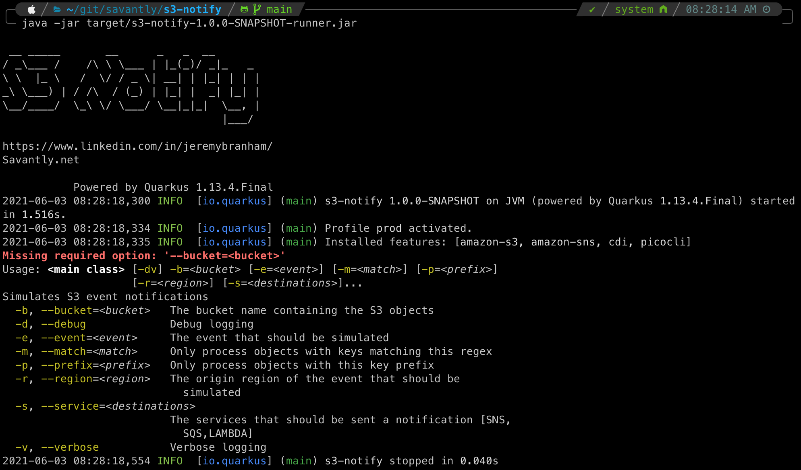

# s3-notify


## Quick start

### Jar File
Download the [latest release](https://github.com/savantly-net/s3-notify/releases)  

Execute from the command line to trigger S3 notifications for a specific bucket/objects.  

Example -  

`$ java -jar target/s3-notify-1.0.0-SNAPSHOT-runner.jar   `

                                                                                                                                                    

### Docker
You can also run the command using Docker -  
`docker run -v ~/.aws:/root/.aws savantly/s3notify:latest --bucket=my-bucket --prefix=qwerty123`  

## Example
Example processing a bucket using a prefix and regex matcher -  

```
$ java -jar target/s3-notify-1.0.0-SNAPSHOT-runner.jar  --bucket=my-bucket-xxxx --prefix=gndxfer/10 -m ".*/202105\d{2}/(GNDITEM|GNDSALE).dbf"                                         

 __ _____       __      _   _  __
/ _\___ /    /\ \ \___ | |_(_)/ _|_   _
\ \  |_ \   /  \/ / _ \| __| | |_| | | |
_\ \___) | / /\  / (_) | |_| |  _| |_| |
\__/____/  \_\ \/ \___/ \__|_|_|  \__, |
                                  |___/

https://www.linkedin.com/in/jeremybranham/
Savantly.net

           Powered by Quarkus 1.13.4.Final
2021-05-27 22:18:09,012 INFO  [io.quarkus] (main) s3-notify 1.0.0-SNAPSHOT on JVM (powered by Quarkus 1.13.4.Final) started in 1.424s.
2021-05-27 22:18:09,012 INFO  [io.quarkus] (main) Profile prod activated.
2021-05-27 22:18:09,013 INFO  [io.quarkus] (main) Installed features: [amazon-s3, amazon-sns, cdi, picocli]
2021-05-27 22:18:09,854 INFO  [net.sav.aws.S3Notify] (main) matched topic: s3:ObjectCreated:*
2021-05-27 22:18:09,855 INFO  [net.sav.aws.S3Notify] (main) Sending notifications to: [SNS], for files in bucket: my-bucket-xxxx matching prefix: gndxfer/10
2021-05-27 22:18:09,855 INFO  [net.sav.aws.S3Notify] (main) debug: false, verbose: false, event: ObjectCreated:Put, match: .*/202105\d{2}/(GNDITEM|GNDSALE).dbf
2021-05-27 22:22:08,959 INFO  [net.sav.aws.S3Notify] (main) notifications: 392, skipped: 372260
2021-05-27 22:22:08,968 INFO  [io.quarkus] (main) s3-notify stopped in 0.007s
```


A native executable can be built, but I'm new to quarkus and haven't done this yet.  

Feel free to submit a PR!  


# Development

This project uses Quarkus, the Supersonic Subatomic Java Framework.

If you want to learn more about Quarkus, please visit its website: https://quarkus.io/ .


## Packaging and running the application

The application can be packaged using:
```shell script
./mvnw package
```
It produces the `quarkus-run.jar` file in the `target/quarkus-app/` directory.
Be aware that it’s not an _über-jar_ as the dependencies are copied into the `target/quarkus-app/lib/` directory.

If you want to build an _über-jar_, execute the following command:
```shell script
./mvnw package -Dquarkus.package.type=uber-jar
```

The application is now runnable using `java -jar target/quarkus-app/quarkus-run.jar`.

## Creating a native executable

You can create a native executable using: 
```shell script
./mvnw package -Pnative
```

Or, if you don't have GraalVM installed, you can run the native executable build in a container using: 
```shell script
./mvnw package -Pnative -Dquarkus.native.container-build=true
```

You can then execute your native executable with: `./target/s3-touch-1.0.0-SNAPSHOT-runner`

If you want to learn more about building native executables, please consult https://quarkus.io/guides/maven-tooling.html.

